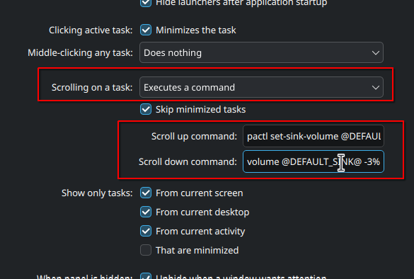

# KDE taskmanager Plasmoid (Customized)

This is a customized version of the KDE taskmanager plasmoid, originally copied from `/usr/share/plasma/plasmoids/` and adapted to fit my needs.

Basically it just adds an option to allow you to customize what happens when you use the scroll wheel.


---

## ✨ Added Features

New options have been added, highlighted in red below:



The scroll up/down commands are obviously customizable.
I just happen to like being able to adjust my system audio volume by scrolling anywhere on the taskbar.

---

## 🚀 Installation

1. Copy the entire directory to your local plasmoids folder:
    ```sh
    cp -r org.kde.plasma.taskmanager ~/.local/share/plasma/plasmoids/
    ```
    Ensure that `metadata.json` ends up at:
    ```
    ~/.local/share/plasma/plasmoids/org.kde.plasma.taskmanager/metadata.json
    ```

2. Restart Plasma to apply changes:
    - Either run:
      ```sh
      killall plasmashell && kstart5 plasmashell
      ```
    - Or simply log out and log back in.

    > **Note:** If you already had a taskmanager widget, it will be replaced with this customized version.

---

## ❌ Uninstallation

To remove the plasmoid, simply delete its directory:
```sh
rm -rf ~/.local/share/plasma/plasmoids/org.kde.plasma.taskmanager
```

---

## 🐞 Debugging

After installing, you can test the plasmoid using:
```sh
plasmawindowed org.kde.plasma.taskmanager
```

---

## 💡 Tips

For testing commands, you can use:
- `kdialog --msgbox "This is a test message box!"`

For scrolling commands, it's better to use something like:
- `pactl set-sink-volume @DEFAULT_SINK@ -1%` since it shows an OSD/popup
